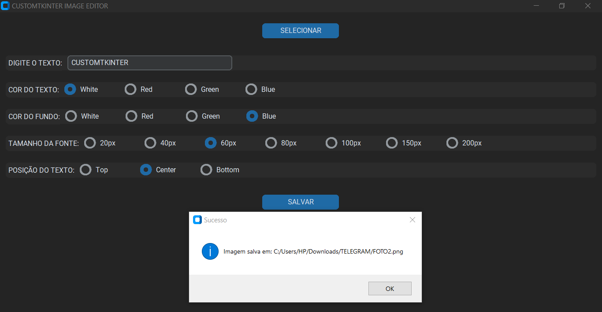
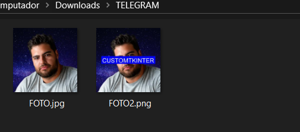
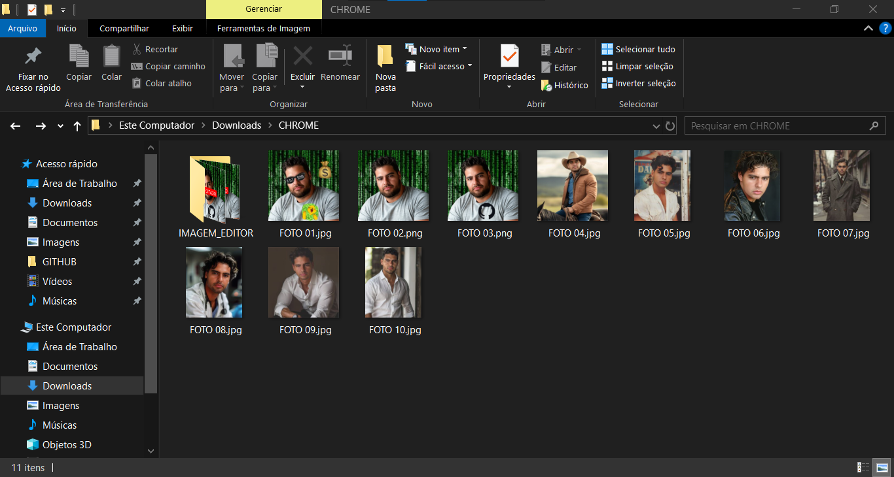
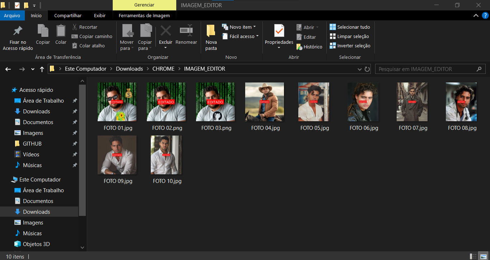

# IMAGEM EDITOR
👨‍🏫É UM APLICATIVO PYTHON DE EDIÇÃO EM LOTE QUE ADICIONA TEXTOS PERSONALIZADOS (COR, FUNDO, TAMANHO E POSIÇÃO) A IMAGENS E SALVA OS RESULTADOS EM UMA NOVA PASTA.

 <br>
 <br>
 <br>
 <br>

## DESCRIÇÃO:
Esse é um **aplicativo de edição de imagens em lote** feito em Python, usando `customtkinter` para a interface gráfica e `PIL (Pillow)` para manipulação de imagens. Ele permite adicionar textos sobre imagens com personalização de **cor, fundo, tamanho e posição**, salvando todas as imagens editadas em uma nova pasta. 

## FUNCIONALIDADES:
1. Permite selecionar um **diretório** contendo imagens (`.jpg`, `.jpeg`, `.png`).
2. Permite adicionar um **texto** que será sobreposto às imagens.
3. Permite escolher:

   * **Cor do texto** (`WHITE`, `RED`, `GREEN`, `BLUE`)
   * **Cor do fundo** do texto (retângulo atrás do texto)
   * **Tamanho da fonte** (20, 40, 60, 80, 100, 150, 200 px)
   * **Posição do texto** (`TOP`, `CENTER`, `BOTTOM`)
4. Edita todas as imagens do diretório e cria uma nova pasta chamada `IMAGEM_EDITOR` com os arquivos modificados.
5. Mostra uma **barra de progresso** indicando quantas imagens foram processadas.
6. Exibe mensagens de status em tempo real e alerta quando o processo termina.

## EXECUTANDO ESSE PROJETO:
1. **Instalação das Dependências::**
   - Entre no diretório `CODIGO` e execute o comando:

   ```bash
   pip install -r requirements.txt
   ```

2. **Execução do Aplicativo:**
   - Para executar o arquivo Python, utilize o comando abaixo no terminal, dentro do diretório `./CODIGO`:
   ```bash
   python CODIGO.py
   ```

2. A interface será aberta em modo escuro.

3. **Digite o texto** que deseja colocar nas imagens no campo `DIGITE O TEXTO:`.

4. **Escolha as opções de estilo do texto**:

   * Cor do texto
   * Cor do fundo do texto
   * Tamanho da fonte
   * Posição (topo, centro ou base da imagem)

5. Clique em **DIRETÓRIO** e selecione a pasta com as imagens que deseja editar.

6. Clique em **EDITAR** para iniciar o processo.

7. Acompanhe o progresso na **barra de progresso** e nas mensagens de status.

8. Ao final, todas as imagens editadas estarão em uma subpasta `IMAGEM_EDITOR` dentro do diretório selecionado.

## SOBRE O EXECUTAVEL E O INSTALADOR:
### 1. EXECUTANDO O INSTALADOR:
   * O instalador está localizado no diretório `./APP` e está disponível apenas para sistemas **Windows x64**. Para realizar a instalação, basta **dar dois cliques no arquivo** e seguir as instruções exibidas na tela.

### 2. GERANDO O EXECUTAVEL:
> **IMPORTANTE:** Antes de criar o instalador, é necessário gerar o arquivo `IMAGEM EDITOR.exe`. Para isso, siga os passos abaixo:

   **1. Instalação do PyInstaller:**
   * Certifique-se de ter o PyInstaller instalado. Se não tiver, instale usando o comando abaixo:
   ```bash
   pip install pyinstaller
   ```

   **2. Gerando o Executável:**
   * No diretório `./CODIGO`, utilize o comando abaixo para gerar o executável:

   ```bash
   pyinstaller EXECUTAVEL.spec
   ```

   * O executável `IMAGEM EDITOR.exe` será criado na pasta `./CODIGO/dist`.
   * Após a geração, você pode excluir a pasta `./CODIGO/build`.

### 3. GERANDO O INSTALADOR:
#### PASSO 1: BAIXAR E INSTALAR O INNO SETUP:
1. **Download**: Baixe o Inno Setup do site oficial: [Inno Setup](http://www.jrsoftware.org/isdl.php).
2. **Instalação**: Siga o assistente de instalação para instalar o Inno Setup no seu sistema.

#### PASSO 2: CRIAR O INSTALADOR:
> **IMPORTANTE:** Antes de criar o novo instalador, certifique-se de excluir o arquivo `./APP/IMAGEM EDITOR.exe`.

1. **Editar o arquivo do instalador:**
   * No diretório `./CODIGO`, abra o arquivo `INSTALADOR.iss` e atualize o seguinte trecho:

   * Localize a diretiva `#define Diretorio` e substitua pelo caminho correto do diretório do projeto. Exemplo:

     ```ini
     #define Diretorio "C:\Users\HP\Downloads\GITHUB\REPOSITORIO\02-PROJETOS PUBLICOS\02-APLICATIVOS\IMAGEM EDITOR\CODIGO"
     ```

2. **Gerar o instalador no Inno Setup:**
   * Abra o arquivo `./CODIGO/INSTALADOR.iss` com o **Inno Setup**.
   * Clique em **"Compile"** para gerar o instalador.

3. **Limpar arquivos temporários:**
   * Após a criação do instalador, você pode excluir o executável temporário `./CODIGO/dist/IMAGEM EDITOR.exe`.

4. **Instalando o Aplicativo:**
   * Se o `Aplicativo` não iniciar automaticamente a instalação, você pode executar manualmente o arquivo `./APP/IMAGEM EDITOR.exe` clicando duas vezes sobre ele.
   * O assistente de instalação será iniciado e, por padrão, o aplicativo será instalado no seguinte caminho: `C:\Program Files\IMAGEM EDITOR`.

## NÃO SABE?
- Entendemos que para manipular arquivos em muitas linguagens e tecnologias, é necessário possuir conhecimento nessas áreas. Para auxiliar nesse aprendizado, oferecemos cursos gratuitos e alguns subsídios:
* [CURSO DE PYTHON](https://github.com/VILHALVA/CURSO-DE-PYTHON)
* [CURSO DE CUSTOMTKINTER](https://github.com/VILHALVA/CURSO-DE-CUSTOMTKINTER)
* [CONFIRA MAIS CURSOS](https://github.com/VILHALVA?tab=repositories&q=+topic:CURSO)
* [DOCUMENTAÇÃO OFICIAL DO PYINSTALLER](https://pyinstaller.org/en/stable/)
* [DOCUMENTAÇÃO OFICIAL DO INNO SETUP](http://www.jrsoftware.org/isinfo.php)

## CREDITOS E MAIS:
- [PROJETO BASEADO NO "IMAGEM CONVERTER"](https://github.com/VILHALVA/IMAGEM-CONVERTER)
- [CLIQUE AQUI PARA VER O HISTÓRICO DE ATUALIZAÇÕES](./UPDATES.md)


